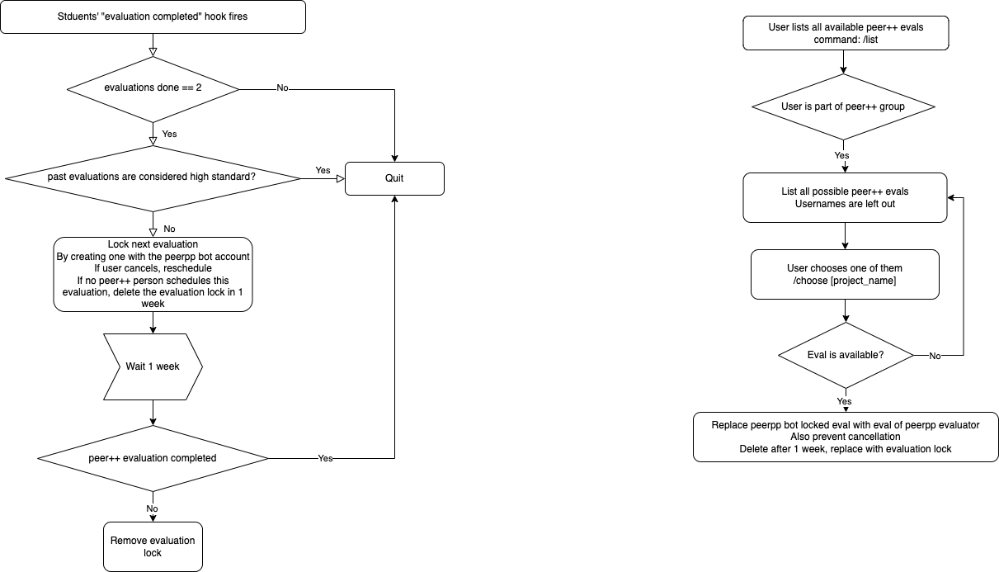

# Peer++ bot

This repository contains:
- `slackbot.py` A slack bot that matches students for evaluating a peer++ evaluation

## Names used internally
Please do not other variable names for storing id's in this project since we're working with a lot of them in this project

- slack_uid = U035QESC45D
- intra_uid = 75138
- intra_login = jkoers
- corrector_intra_login = jkoers
- corrector_intra_uid = 75138
- corrected_intra_login = fbes
- corrected_intra_uid = 69696

- project_name = libft
- project_id = 1314